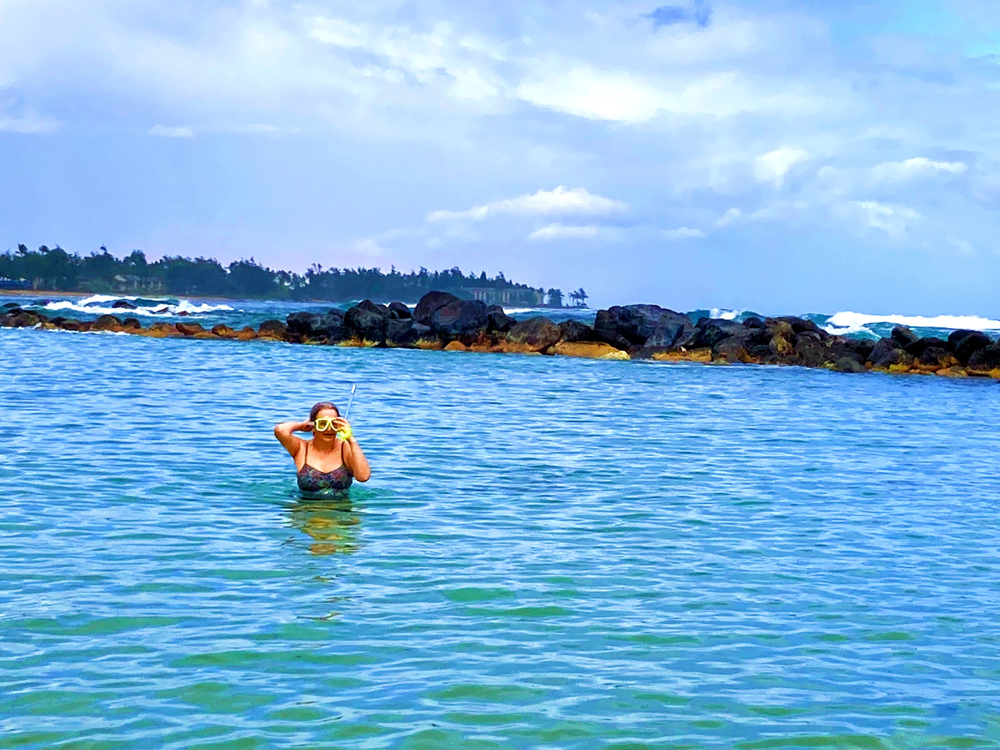

## Kauai 2023

## The Trip

Tanya and Bobby flew to Kauai in January 2023 on Southwest Airlines. The flight was not full, so we had plenty of room to relax. It's a little over a 5 hour flight.

## Hotel

[Hilton Garden Inn Kauai Wailua Bay](https://www.google.com/maps/place/Hilton+Garden+Inn+Kauai+Wailua+Bay/@22.0294988,-159.3356866,9067m/data=!3m1!1e3!4m17!1m7!3m6!1s0x7c0704bb259eb047:0xf6321af5a12d378a!2sKauai!8m2!3d22.0964396!4d-159.5261238!16zL20vMGpic24!3m8!1s0x7c06e1cc9982ea4f:0xf81a6eb038d1d7e4!5m2!4m1!1i2!8m2!3d22.0422873!4d-159.3370131!16s%2Fg%2F11cjnjzhkh?hl=en&authuser=0)
5 Miles north of Lihue

## Pictures

